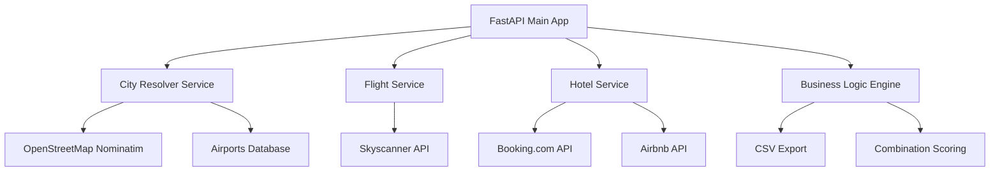

# 🌍 Holiday Engine - Intelligent Travel Search Platform

> **Live City Search | Global Coverage | Service-Oriented Architecture**
>
> A professional travel search platform that combines real-time city autocomplete with intelligent flight and hotel combinations. Type any city name and get instant travel options with smart airport resolution.

[](https://python.org)
[](https://fastapi.tiangolo.com)
[](https://nominatim.openstreetmap.org)
[](LICENSE)

---

## ✨ Key Features

### 🔍 **Live City Autocomplete**

- **Real-time search** as you type using OpenStreetMap Nominatim
- **Global coverage** - search any city, town, or village worldwide
- **Country flags** 🇪🇸🇬🇷🇩🇪 and smart suggestions
- **Keyboard navigation** (↑↓ Enter Escape)
- **300ms debounced** for smooth performance

### ✈️ **Smart Flight Search**

- **Automatic airport resolution** using 83,253 airports database
- **Intelligent geocoding** finds nearest airport for any location
- **Live flight data** from Skyscanner via Apify
- **Real booking links** with direct integration

### 🏨 **Comprehensive Accommodation Search**

- **Hotels** from Booking.com with ratings and real prices
- **Airbnb properties** with host info and amenities
- **Parallel search** for maximum coverage
- **Smart location targeting** (hotels in city, not airport)

### 🧠 **Intelligent Combinations**

- **Price-to-quality scoring** algorithm
- **Budget filtering** and optimization
- **Export to CSV** for analytics and backup
- **Configurable search limits**

---

## 🚀 Quick Start

### Prerequisites

```bash
Python 3.12+
Git
```

### Installation

```bash
# 1. Clone the repository
git clone https://github.com/your-username/holiday-engine.git
cd holiday-engine

# 2. Create virtual environment
python -m venv venv
source venv/bin/activate  # Linux/Mac
# venv\Scripts\activate   # Windows

# 3. Install dependencies
pip install fastapi uvicorn httpx jinja2 python-dotenv geopy pandas pydantic-settings

# 4. Download airports database
# Place airports.csv in config/ directory (83,253 airports)
# Download from: https://ourairports.com/data/airports.csv

# 5. Configure environment
cp .env.example .env
# Edit .env with your API keys (optional for demo)

# 6. Run the application
python main.py
```

### 🌐 Access the Application

- **Main Interface**: http://localhost:8000
- **Health Check**: http://localhost:8000/health
- **API Documentation**: http://localhost:8000/docs

---

## 📖 Usage Guide

### 🔍 **Live City Search**

1. **Start typing** any city name (e.g., "Mala...")
2. **See instant suggestions** with country flags
3. **Click or press Enter** to select
4. **Automatic airport resolution** (e.g., Malaga → AGP)
5. **Submit search** for real results

### 🎯 **Search Examples**

```
✅ "Schladming" → Finds Austrian ski resort + nearest airports
✅ "Port de Soller" → Mallorca destination + PMI airport
✅ "Admont" → Small Austrian town + LNZ airport (Linz)
✅ "Malaga" → Spanish city + AGP airport
✅ Any city worldwide!
```

### 📊 **Results Overview**

- **Flights Tab**: All available flights with filtering
- **Hotels Tab**: Booking.com results with ratings
- **Airbnb Tab**: Properties with host information
- **Combinations Tab**: Optimized flight+hotel packages

---

## 🏗️ Architecture

### 📁 **Project Structure**

```
holiday-engine/
├── 📁 config/
│   ├── settings.py          # Centralized configuration
│   └── airports.csv         # Global airports database (83,253)
├── 📁 services/
│   ├── flight_service.py    # Flight search logic
│   ├── hotel_service.py     # Hotel & Airbnb search
│   └── city_resolver.py     # Smart city → airport resolution
├── 📁 utils/
│   ├── api_client.py        # Unified API client with retry logic
│   └── data_parser.py       # Clean data parsing services
├── 📁 templates/
│   ├── index.html           # Main search interface (live autocomplete)
│   ├── results.html         # Results display with filtering
│   └── error.html           # Error handling
├── 📁 output/               # CSV exports for analytics
├── business_logic.py        # Travel combination engine
├── main.py                  # FastAPI application entry point
├── .env                     # Environment configuration
└── README.md               # This file
```

### 🔧 **Service Architecture**



---

## ⚙️ Configuration

### 🔑 **Environment Variables**

```bash
# .env file
APIFY_TOKEN=your_apify_token_here          # Optional: For real API data
DEBUG=false                                # Debug mode
MAX_HOTELS_TO_SHOW=50                     # Hotels in results
MAX_AIRBNB_TO_SHOW=20                     # Airbnb properties in results
MAX_FLIGHTS_PER_SEARCH=10                 # Flights per direction
```

### 🎛️ **Configurable Settings**

All limits configurable in `config/settings.py`:

```python
# Search Configuration
max_outbound_flights: int = 5      # Outbound flights to show
max_return_flights: int = 5        # Return flights to show
max_hotels_to_show: int = 30       # Hotels in UI
max_airbnb_to_show: int = 20       # Airbnb properties in UI

# Performance Tuning
max_hotels_to_parse: int = 200     # Hotels to request from API
max_airbnb_to_parse: int = 100     # Airbnb properties to request
```

---

## 🔌 API Integration

### ✈️ **Flight Data**

- **Provider**: Skyscanner via Apify
- **Actor**: `jupri/skyscanner-flight`
- **Coverage**: Global flight search
- **Features**: Real prices, booking links, airline info

### 🏨 **Hotel Data**

- **Provider**: Booking.com via Apify
- **Actor**: `voyager/fast-booking-scraper`
- **Coverage**: Worldwide hotels
- **Features**: Ratings, prices, direct booking

### 🏠 **Airbnb Data**

- **Provider**: Airbnb via Apify
- **Actor**: `tri_angle/new-fast-airbnb-scraper`
- **Coverage**: Global properties
- **Features**: Host info, amenities, reviews

### 🌍 **City Data**

- **Provider**: OpenStreetMap Nominatim
- **Coverage**: Global city/town/village database
- **Features**: Live autocomplete, geocoding
- **Rate Limit**: Respectful usage with 300ms debouncing

---

## 📊 Performance Metrics

### ⚡ **Typical Search Performance**

```
🔍 City Resolution:     < 1 second
✈️ Flight Search:       15-30 seconds  
🏨 Hotel Search:        20-40 seconds
🏠 Airbnb Search:       15-25 seconds
🎯 Combination Logic:   < 1 second
📁 CSV Export:          < 1 second

Total Search Time:      30-60 seconds
Results Coverage:       150+ accommodations, 20+ flights
```

### 🎯 **Sample Results**

**Search**: Admont → Malaga

```
✅ City Resolution: Admont → LNZ, Malaga → AGP
✅ Flights Found: 26 flights (LNZ ↔ AGP)
✅ Hotels Found: 50 hotels in Malaga
✅ Airbnb Found: 100 properties in Malaga  
✅ Combinations: 5 optimized packages
⏱️ Total Time: 33 seconds
```

---

## 🧪 Testing

### 🔧 **Development Testing**

```bash
# Test individual components
python services/city_resolver.py
python services/flight_service.py
python utils/api_client.py

# Test API endpoints
curl http://localhost:8000/health
curl "http://localhost:8000/api/cities/autocomplete?q=Malaga"
curl "http://localhost:8000/api/cities/resolve?city=Schladming"
```

### 🌍 **Live Testing Cities**

Try these diverse locations to test global coverage:

```
🇦🇹 Austria: "Hallstatt", "Admont", "Schladming"
🇪🇸 Spain: "Malaga", "Port de Soller", "Santander"  
🇬🇷 Greece: "Rhodes", "Santorini", "Mykonos"
🇮🇹 Italy: "Cinque Terre", "Positano", "Portofino"
🇺🇸 USA: "Aspen", "Martha's Vineyard", "Key West"
🌍 Global: "Faroe Islands", "Tasmania", "Azores"
```

---

## 📈 Analytics & Export

### 📁 **CSV Export Features**

Every search automatically exports to `output/` directory:

- **flights_*.csv**: Flight data with prices, airlines, booking links
- **hotels_*.csv**: Hotel data with ratings, prices, locations
- **airbnb_*.csv**: Airbnb data with host info, amenities, pricing

### 📊 **Analytics Capabilities**

```python
# Example: Analyze search patterns
import pandas as pd

# Load exported data
flights = pd.read_csv('output/flights_Admont_Malaga_20250703.csv')
hotels = pd.read_csv('output/hotels_Admont_Malaga_20250703.csv')

# Analyze price trends, popular destinations, etc.
avg_flight_price = flights['price_eur'].mean()
top_rated_hotels = hotels.nlargest(5, 'rating')
```

---

## 🔧 Development

### 🛠️ **Adding New Features**

#### Add New City Source:

```python
# In services/city_resolver.py
def _load_common_cities(self):
    return {
        'your_city': 'IATA_CODE',
        # Add more mappings
    }
```

#### Add New API Provider:

```python
# In services/flight_service.py
async def search_new_provider(self, origin, destination, date):
    # Implement new API integration
    pass
```

#### Configure Search Limits:

```python
# In config/settings.py
max_hotels_to_show: int = 100  # Increase hotel results
max_flights_per_search: int = 20  # More flight options
```

### 🧩 **Extending the Platform**

- **Mobile App**: Use FastAPI as backend API
- **Price Alerts**: Add background monitoring
- **User Accounts**: Implement authentication
- **Advanced Filters**: Add more search criteria
- **Multi-language**: Internationalization support

---

## 🤝 Contributing

### 🔧 **Development Setup**

```bash
# Fork and clone
git clone https://github.com/your-username/holiday-engine.git

# Create feature branch  
git checkout -b feature/amazing-feature

# Install development dependencies
pip install pytest black ruff mypy

# Run tests
pytest test/

# Format code
black .
ruff check .
```

### 📝 **Code Standards**

- **Type hints** for all functions
- **Docstrings** for public methods
- **Error handling** with proper logging
- **Unit tests** for new features
- **Configuration** via settings.py

---

## 📄 License

MIT License - see [LICENSE](LICENSE) file for details.

---

## 🙏 Acknowledgments

- **OpenStreetMap**: Global city data via Nominatim API
- **Apify**: Professional travel API access
- **FastAPI**: High-performance web framework
- **OurAirports**: Comprehensive airports database
- **Travel Community**: Inspiration and feedback

---

## 📞 Support

### 🐛 **Issues & Bugs**

- GitHub Issues: [Report bugs](https://github.com/gerfru/holiday-engine/issues)
- Feature Requests: [Suggest features](https://github.com/gerfru/holiday-engine/discussions)

### 📖 **Documentation**

- **API Docs**: `/docs` endpoint (auto-generated)
- **Architecture**: See `CLAUDE.md` for detailed development info
- **Configuration**: All options documented in `config/settings.py`

---

**🌍 Built for travelers worldwide - Making travel planning intelligent, simple, and accessible! ✈️🏖️**

*Holiday Engine v2.0 - The future of travel search is here.*
